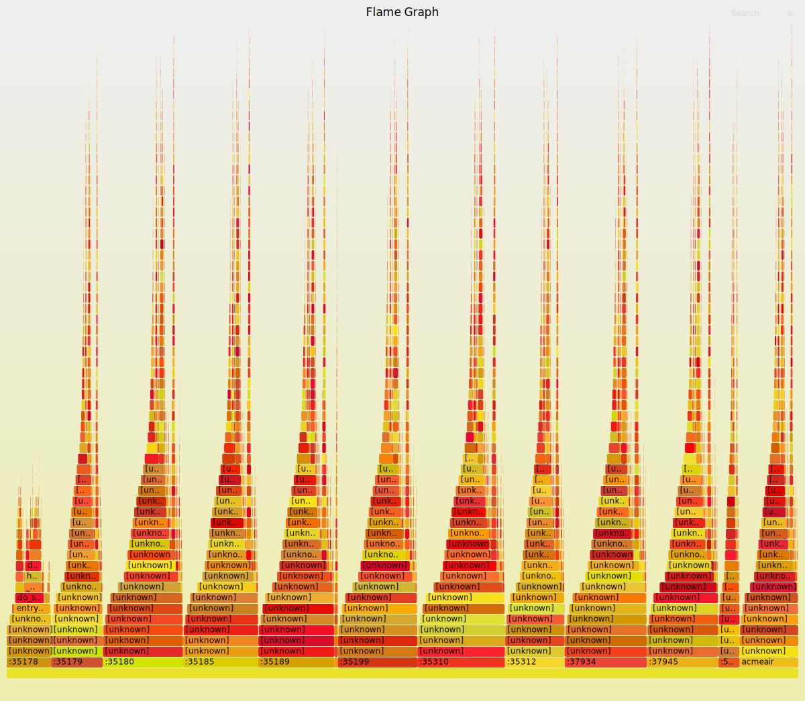

# Performance evaluation of web-server in a containerized environment - NPRG131 Exam Report

In this paper[1] authors describe a new form of profiling that combines sampling and event based profiling to search for layered bottlenecks in large scale, even distributed, applications such as a web server or a blockchain network.
This kind of performance evaluation peaked my interest because evaluation of applications on distributed scale seemed complex and I wasn't aware of how to do such thing.
Obviously in order to properly measure distributed scale applications you need proper hardware and I did not obtain access to such hardware.
However, I though that containerized environment could provide me with an opportunity to try out the toolchain on a smaller scale even though the results do not reflect actual real-world scenario in any way.


## Background

Aforementioned paper used and expanded `pprof` profiling tool in the Go language by introducing a novel concept of *wake-up profiles*.
My original intent was to reproduce the scenario profiling open-source web application - AcmeAir benchmark[2] and try out the new profiling technique with special version of the `go`[4].
Even though I was able to obtain so called *wakeup-profile* I wasn't able to find tooling that would process the output and it seemed a bit tedious to write it myself so I have settled to ommit this part.


Performance analysis of AcmeAir has already done in the referenced paper[5] where authors compared performance competetiveness of dynamically compiled languages (Java, NodeJS) and statically compiled languages (Go).
For this purpose they have compared AcmeAir benchmark[2] with original Java and NodeJS implementations with their own Go version of the application - AcmeAirGo[3].
This version allows me to use quite extensive profiling capabilities of the `pprof`[6] tool in addition to other tools covered in the lecture.


## Setup

AcmeAir is a simple web-application for a fititious airline.

A client can:
* query available flights for given origin and destination city,
* book and cancel an available flight,
* list booked flights, and
* update profile.

As a persistent store AcmeAir can use either MongoDB or Apache Cassandra but the autors of study[5] chose MongoDB as the only version for AcmeAirGo thus I use that one.
They also used Gin webframework instead of built in standard library web tools.

The general setup from studies[1,5] is the following:

### Figure 1:
```
    DRIVER HOST |       |    APPLICATION HOST   |      | DATABASE HOST
                |  REST |       AcmeAirGo       | BSON | 
       JMeter   |  ---> | Gin -> AcmeAir -> mgo | ---> |    MongoDB
```

In these study[1] each host is a virtual machine with:
* 32 core x86_64 2.0 GHz CPU
* 64 GB of memory
* 215 GB of storage
* 10 Gbit ethernet between hosts
* Ubuntu 16.10


### AcmeAir Benchmark

AcmeAir is meant to be used as an example web-application used in benchmarks.
For this purpose there are so called drivers that describe what should a load generator, such as JMeter, do to emulate users.

I have found this driver[7] that describes what should a JMeter do as in the study[1,5]:
1. Login
2. Update customer profile (25% of the time)
3. Loop 5 times:
    * Query a flight
    * Book a flight (if available)
4. List bookings
5. Cancel bookings (if there are at least 2)
6. Logout

This are described in diver repository as XML configuration of JMeter.

In study[1] JMeter is set to spawn 64 client threads via a JMeter thread group and targets to issue 2000 transactions per second.
As hinted in the introduction I do not have access to such hardware setup and thus I've tried to utilize my laptop only.


### Hardware setup

* Intel(R) Core(TM) i7-6700HQ CPU @ 2.60GHz
    * 4 core, 1 socket, 8 threads
* 16 GB memory
* Linux 5.10.61-1-MANJARO

Since hardware is not sufficient to compare to studies[1,5] I've decided to use Docker with restrained resources to split up the available machines somewhat fairly.
As per Figure 1:
* DRIVER HOST
    * Natively running process constrained to 2 threads via constraining the thread group size.
* APPLICATION HOST
    * Docker instance of the web application AcmeAirGo that exposes HTTP port.
    * 2 CPUs, 2 GB memory limit
* DATABASE HOST
    * MongoDB docker image from the docker hub, using specific version because the latest failed on some weird carriage return issue.
    * Connected to APPLICATION HOST via common docker network and persistent volume.
    * 2 CPUs, 2 GB memory limit, though mongoDB has to be persuaded to use only specified amount of memory via command line otherwise it takes it all and I had to add `--wiredTigerCacheSizeGB 1.5` parameter to `mongod` invocation.

> Notes:
> I wanted to put JMeter into container so that I would be able to restrict it in similar fashion as others and also isolate it from the host system but it did not really work for me.

Other than that there is one core left and I tried to calm down the host system so that it wouldn't influence measurements, but I did not find any "best practises" for this other than close all runnning applications apart from our measurements.


## Measurement tools

The study[1] introduced me to Go language and tooling around it.
Other than that I also tried to search for some tools to observe performance of the containers in general and that brought me to Brendan Gregg and his talk at the LISA2017 conference[9].


### `pprof`

I found the native tooling most interesting particularly the `go tool pprof` as it turns out to have a lot of built in profiling features, both sampling and event based.
The language design has userspace threads so-called "goroutines" that are basically lightweight threads managed by Go runtime that maps it to hardware threads.

The `pprof` tool can be used in many different ways:
* profile can be captured directly using pprof API from code and written to a file in the end, or
* program can expose pprof API via HTTP interface and since we are already running a web server this is the way I've chosen.

The chosen option is simple to execute from the host since the AcmeAir container already exposes HTTP port and we can connect to it from host and capture a profile.


### `perf`

A `perf` tool was covered in the lecture and it can be used in here as well though it has some caveats.

My initial idea was to run it from within acmeair container but that has some issues:
* First I had to install perf to the container itself and after some issues with versioning I was able to install correct version.
* However, it was not able to run `perf_event_open` syscall with "Operation is not permitted" and it suggests to tweak `proc/sys/kernel/perf_event_paranoid` but that does not fix it.
* It requires to change the SECCOMP policy when executing docker as it blacklists access to perf events because they are a side channel to host. Other option is to allow root capability to a container by changing its CAP-abilities.
* As I wanted it to be automatic and not manual I could not have used interactive mode. But that is alright, we can just capture the profile right? So I've executed `perf` with the acmeair binary from within `entrypoint.sh` and redirected the output to mounted volume to store the profile data. Unfortunatelly, after test running `docker-compose down` does not properly terminate `perf` and thus the profile data is not readable. This behavior probably can be somehow altered by some teardown procedure but I did not find any such workaround.

Fortunatelly around that time I've found Brendan Gregg's presentation about container performance analysis[9] where he pointed out that you can limit the scope of what `perf` is measuring by restricting it to single cgroup of a container using `--cgroup` option.
Thus I've used `perf` tool from the host as well.


### Container resource utilization

`docker stats` displays cpu, memory, network, disk and process number resource utilization per container.
I've create `docker-resource.sh` script to process output of this command and store it in csv format along with time information.
This can be used to monitor resource utilization of all currently running containers.


### Reproducing measurements

**Run AcmeAir Web application and MongoDB**

1. Clone the repository[3] and apply `acmeair-go.patch`, from this repo, that just adds working versioning and resource limitations.
2. Build the `acmeair-go` docker image in the repo:
    ```
    docker build --tag acmeair-go .
    ```
3. Try out that the containers can be started, verify by accessing [acmeair on localhost](http://localhost:8080/)
    ```
    docker-compose up
    ```
4. Prior to launching any load we have to fill the database with some users and flights, for that I've used the [web interface loader](http://localhost:8080/loader.html) that fills the database with fictitious users and predefined flights from cities present in the repository.

> Note:
> AcmeAirGo port supports only REST endpoints and it does not connect them to actual web interface, thus I was not able to list loaded flights from the web site.

---

**Install,setup and run JMeter**
1. Install JMeter, I've just used linux package and I had to use Java8.
2. Clone repository[7].
3. Follow the steps in the [README](https://github.com/acmeair/acmeair-driver/tree/master/acmeair-jmeter#jmeter-workload-setup-instructions) and pay attention to bottom section that is NodeJS specific but Go implementation is stemmed from NodeJS thus this applies as well. I did not bother with listener specification as I've found out that it can actual produce a full-fledged HTML report with bells and whistles.
4. Open JMeter GUI to configure the load and explore what the load does.
    ```
    jmeter -t acmeair-jmeter/scripts/AcmeAir.jmx
    ```
6. Launch the load, along with report generation, from the CLI as it is discouraged actual measurement from GUI.
    ``` bash
    cd acmeair-jmeter/scripts/
    jmeter -n -t AcmeAir.jmx -DusePureIDs=true --logfile jmeter.log --reportatendofloadtests --forceDeleteResultFile --reportoutputfolder jmeter-report
    ```

---

**Container resource tracking**

To track resource utilization of acmeair and mongo container, monitor `docker stats` each 5 seconds.
Intervals less than 3 seconds are unreliable since `docker stats` invocation tends to take long time on my system.

```
./docker-resources.sh docker-resources.csv 5
```

---

**`pprof` invocation**

While the app (and load) is running run this command that is a nice interactive cpu profiling (sampling) including call graphs (real graphs), flamegraphs etc.
There are also other profile options but the documentation is lacking.

```
# Fancy interactive CPU profile
go tool pprof -http localhost:8888 http://localhost:8080/debug/pprof/profile?seconds=30

# Heap profile
go tool pprof -http :8888 http://localhost:8080/debug/pprof/heap

# Add runtime.SetBlockProfileRate(1) to track all block events then run this
# to see where in terms of stacktrace is your program blocked.
go tool pprof -http :8888 http://localhost:8080/debug/pprof/block

# Add runtime.SetMutexProfileFraction(1) to track all mutex contention
# events then run this to see from where are you contending for a mutex lock.
go tool pprof -http :8888 http://localhost:8080/debug/pprof/mutex

```

The REST based interface can be used with `-http` command or without it and get then you get CLI alternative.
Each invocation stores a profile under `~/pprof` and you can view it using:
```
# Web interface view
go tool pprof -http :8888 ~/pprof/pprof.acmeair.samples.cpu.001.pb.gz

# CLI view
go tool pprof ~/pprof/pprof.acmeair.samples.cpu.001.pb.gz
```

---

**`perf` invocation**

1. As mentioned previsously, if we want to launch `perf` from the host and limit influence of other application or containers we have to find specifc cgroup. To do that I've used `systemctl status` that displays tree of all pgroups and then just searched for `/app/acmeair`. It looks something like this:
    ```
    ├─docker-c1688cddc43817f9aa5f7fe2c50f2a6c434b4732d58c322c2de7770a43ee1019.scope  # name of the cgroup
      ├─35053 /bin/bash /entrypoint.sh /app/acmeair
      └─35177 /app/acmeair
    ```
3. With cgroups.v2 all cgroups should be present somewhere in `/sys/fs/cgroup/` and that is where `perf` will look for them. The issue is that they might be somewhere in the directory structure:
    ```
    cd /sys/fs/cgroup
    find . -name "docker-c1688cddc43817f9aa5f7fe2c50f2a6c434b4732d58c322c2de7770a43ee1019.scope"  # path to the cgroup
    ```
4. And it is still probably not done as while running `perf` we might encounter this error:
    ```
    Error:
    Access to performance monitoring and observability operations is limited.
    Consider adjusting /proc/sys/kernel/perf_event_paranoid setting to open
    access to performance monitoring and observability operations for processes
    without CAP_PERFMON, CAP_SYS_PTRACE or CAP_SYS_ADMIN Linux capability.
    More information can be found at 'Perf events and tool security' document:
    https://www.kernel.org/doc/html/latest/admin-guide/perf-security.html
    perf_event_paranoid setting is 2:
    -1: Allow use of (almost) all events by all users
        Ignore mlock limit after perf_event_mlock_kb without CAP_IPC_LOCK
    >= 0: Disallow raw and ftrace function tracepoint access
    >= 1: Disallow CPU event access
    >= 2: Disallow kernel profiling
    To make the adjusted perf_event_paranoid setting permanent preserve it
    in /etc/sysctl.conf (e.g. kernel.perf_event_paranoid = <setting>)
    ```
5. To solve it just follow the instructions:
    ```
    # echo -1 > /proc/sys/kernel/perf_event_paranoid
    ```
6. Then we can launch `perf`, though the general `stat` or `record` subcommands do need some events to track when `--cgroup` is passed.
    ```
    # Track instruction and cpu-cycles counters on the whole system (-a) restricted to given cgroup for 10 seconds
    perf stat -e instructions,cpu-cycles --cgroup ${CGROUP_PATH_FROM_LAST_FIND} -a -- sleep 10

    # Do a cpu profile with stack traces of the whole system and store output to given file
    perf record -e cpu-cycles --cgroup ${CGROUP_PATH_FROM_LAST_FIND} -a -g -o perf.data -- sleep 10
    ```

---

**Flame graphs!**

In order to create interactive flame graphs:
* use interactive `pprof -http` command shown above, or
* capture perf profile with stack traces (`-g`) and then use Brendan Gregg's FlameGraph repository[10]:
    ```
    $ perf script --input perf.data | ./stackcollapse-perf.pl | ./flamegraph.pl > flamegraph.svg

    $ $BROWSER flamegraph.svg  # and interacttivelly open it in a web browser
    ```

Unfortunately, I was not able to compile go with debug symbols and thus acmeair part of the recorder profile is unknown.
It should be possibly with `go tool compile -E file.go file.go` where `-E` adds debug symbols but this project is split to multiple files in different directories and thus I would have to manually add include paths etc. while `go build .` just does its magic but it does not "add debug symbols" option..


## Measurements

With concrete measurements I did not have any particullar goal it was mostly just and exploration of what is available in such environment.
Still the study comparing Go, Java and NodeJS[5] did give me something to compare against.


### JMeter report

```
$ jmeter -n -t AcmeAir.jmx -DusePureIDs=true --logfile log --reportatendofloadtests --forceDeleteResultFile --reportoutputfolder jmeter.report
Creating summariser <summary>
Created the tree successfully using AcmeAir.jmx
Starting standalone test @ Mon Sep 20 02:40:15 CEST 2021 (1632098415084)
Waiting for possible Shutdown/StopTestNow/HeapDump/ThreadDump message on port 4445
usePureIDs property was set.
summary +   3885 in 00:00:15 =  262.0/s Avg:     0 Min:     0 Max:    34 Err:     0 (0.00%) Active: 1 Started: 1 Finished: 0
summary +  65549 in 00:00:30 = 2185.0/s Avg:     0 Min:     0 Max:    31 Err:     0 (0.00%) Active: 2 Started: 2 Finished: 0
summary =  69434 in 00:00:45 = 1548.8/s Avg:     0 Min:     0 Max:    34 Err:     0 (0.00%)
summary +  85150 in 00:00:30 = 2838.3/s Avg:     0 Min:     0 Max:    17 Err:     0 (0.00%) Active: 2 Started: 2 Finished: 0
summary = 154584 in 00:01:15 = 2065.8/s Avg:     0 Min:     0 Max:    34 Err:     0 (0.00%)
summary +  85130 in 00:00:30 = 2837.7/s Avg:     0 Min:     0 Max:    24 Err:     0 (0.00%) Active: 2 Started: 2 Finished: 0
summary = 239714 in 00:01:45 = 2286.7/s Avg:     0 Min:     0 Max:    34 Err:     0 (0.00%)
summary +  84053 in 00:00:30 = 2801.8/s Avg:     0 Min:     0 Max:    23 Err:     0 (0.00%) Active: 2 Started: 2 Finished: 0
summary = 323767 in 00:02:15 = 2401.3/s Avg:     0 Min:     0 Max:    34 Err:     0 (0.00%)
summary +  84699 in 00:00:30 = 2823.3/s Avg:     0 Min:     0 Max:    31 Err:     0 (0.00%) Active: 2 Started: 2 Finished: 0
summary = 408466 in 00:02:45 = 2478.1/s Avg:     0 Min:     0 Max:    34 Err:     0 (0.00%)
summary +  85323 in 00:00:30 = 2844.1/s Avg:     0 Min:     0 Max:     5 Err:     0 (0.00%) Active: 2 Started: 2 Finished: 0
summary = 493789 in 00:03:15 = 2534.5/s Avg:     0 Min:     0 Max:    34 Err:     0 (0.00%)
summary +  84959 in 00:00:30 = 2832.0/s Avg:     0 Min:     0 Max:     7 Err:     0 (0.00%) Active: 2 Started: 2 Finished: 0
summary = 578748 in 00:03:45 = 2574.2/s Avg:     0 Min:     0 Max:    34 Err:     0 (0.00%)
summary +  84719 in 00:00:30 = 2824.0/s Avg:     0 Min:     0 Max:    23 Err:     0 (0.00%) Active: 2 Started: 2 Finished: 0
summary = 663467 in 00:04:15 = 2603.6/s Avg:     0 Min:     0 Max:    34 Err:     0 (0.00%)
summary +  84485 in 00:00:30 = 2816.2/s Avg:     0 Min:     0 Max:    30 Err:     0 (0.00%) Active: 2 Started: 2 Finished: 0
summary = 747952 in 00:04:45 = 2626.0/s Avg:     0 Min:     0 Max:    34 Err:     0 (0.00%)
summary +  71428 in 00:00:25 = 2833.1/s Avg:     0 Min:     0 Max:     4 Err:     0 (0.00%) Active: 0 Started: 2 Finished: 2
summary = 819380 in 00:05:10 = 2642.8/s Avg:     0 Min:     0 Max:    34 Err:     0 (0.00%)
Tidying up ...    @ Mon Sep 20 02:45:25 CEST 2021 (1632098725213)
... end of run
```

As you can see the load testing did issue 819380 calls/transactions in 5 minutes from 2 thread in Thread group.
The report can be viewed in the browser:
```
$BROWSER data/jmeter.report/index.html
```

It is loaded with information about request fail rates, latencies samples, and charts, many of them.
The mentioned studies focused on Tx/sec - Transactions per second and utilization.
As expected in Charts -> Throughput there are 2 charts for Transactions per second, one per service, one cumulative.
The setup with 2 CPUs was able to handle ~2800 Tx/sec at most.
But to see the full picture I've tracked resource utilization via my custom script while doing the load.

Apart from transactions and different services overview the JMeter report is not very useful because of localhost virtual network between all involved components the latencies and response time is irrelevant.


### Resource utilization

The resource utilization during the load is measured by custom `docker-resources.sh` script and the results are in the `plot.ipynb` python notebook.
CPU utilization on the app is nearing 100% while database is not really that occupied.
Memory of 2GiB per container was a bit too overprovisioned even for the mongo.
Mongo was also the only one using Block output i.e. writing to docker virtual block device.
The setup from the study[5] mentiones that they've kept everything in the memory (they had >300GB just on the DB host), the CPU profiling will show whether this impacted us.

Actual numbers from network are not that important but in this kind of setup we can differentiate how much NetI/O was JMeter driving since app was in the middle of JMeter and MongoDB.
This can be compared to byte throughput from JMeter report.

The last interesting thing is that it actually shows how much processed the containers have in this case 35 for MongoDB and 23 for AcmeAir.
I don't really know what drives the "load balancing" of the AcmeAir but I have to state that I've been running this load mutliple times on already running container setup and thus it is very much likely that on cold startup the number of AcmeAir processed would scale up.


### CPU profiling

Now that we have showed the results of the measurements I'll try to get insight into what was happening with profiling tools.

Comparison study[5] has a really nice graph showing how barplot that does compare different parts of individual implementations.
I think that parittioning CPU by code sampling is really nicely expressed in form of flame graphs (to be fair to represent what they wanted to they would need some sort of overlaying flamegraphs).
As mentioned above without debug symbols `perf` doesn't show any symbols in go part of the application but it monitors the kernel.
Complementary is the `pprof` profile that does not know about the kernel but it does know how to interpret go symbols via its runtime.
Both profiles are stored in `data` subdirectory.

**pprof profile**
When calling `go tool pprof -http :8888 data/pprof.acmeair.samples.cpu.001.pb.gz` you get call graph and the bigger the nodes the more samples were in that particular function.
Here we can see that app spent only roughly 60% of its time serving http requests, another 20% doing syscalls and remaining 10% waiting on futex.
Syscalls are mostly called from on class `(*mongoSocket) and it makes sense that DB access required write syscalls.

The futex is mostly called from runtime and I did not really understand reason why it is there and why it takes 10% or runtime.
Now transition towards a flamegraph via `View -> Flame Graph`.
This is the same data as in previous graph though it shows proportions of indiviual nodes better.
For the http server part it is clearly visible how much CPU time is spent on individual REST endpoint: BookFlights, CancelBooking, Login, QueryFlights...
Where QueryFlights is the most CPU intensive of these and if we zoom in on it we can see that it spends 25% in parsing JSON alone supposedly because mongo stores and thus returns data in JSON format and query might contain substantialy more data than user profile changes for example.


I have tried to match it to the wakeup profile study[1] that focused on particullar contention on a mutex in mongo access code.
The implementation comparing study[5] used different approach by tracking what goroutine is stopped at particullar mutex.
For that purpose I've altered the code of the app to track all the blocked and lock contention events by adding this to main:
``` go
	runtime.SetBlockProfileRate(1)
	runtime.SetMutexProfileFraction(1)
```
This profile is also stored in the data folder together and at the top you can switch Samples between Delay - Block profile and Contention - Mutex profile:
* Delay - How much time was spent in some blocked state and what was the origin (proportionaly)?
    * In the profile we see that 90% of the time was spent in `runtime - selectgo` which is a language concept similar to `select` call from C. And that "selected" accesses were directed to the MongoDB.
* Contention - Who and how many times is acquiring a mutex?
    * Here we see that `main` and `gin (*Context) Next` are waiting for each other 60% of the time, that suggest to me a state of idling or not enough requests to process.
    * Other thing is that if there is a request to process each has to validate session cookie and that does some wait on the DB request persumably.

**perf profile**
Since app does not contain debug symbol perf shows a lot of unknown parts in its stack apart from some parts of the kernel stack.
To see full picture there is a flamegraph from this profile .
It also contains multiple suspiciously simmilar flames and only one is labeled acmeair.
This is probably because Gin framework launches multiple acmeair processes that are in the same container thus same cgroup, and they are showed in the resource utilization section.


### Cycles per instruction (CPI) and cache misses

Another part of comparison study[5] was CPI and accompanied explanation of low L1 cache misses.
```
$ perf stat -e cpu-cycles,instructions,L1-dcache-load-misses --cgroup ./system.slice/docker-c1688cddc43817f9aa5f7fe2c50f2a6c434b4732d58c322c2de7770a43ee1019.scope -a -- sleep 10

 Performance counter stats for 'system wide':

    24,525,158,017      cpu-cycles                ./system.slice/docker-c1688cddc43817f9aa5f7fe2c50f2a6c434b4732d58c322c2de7770a43ee1019.scope                                   
    15,277,918,217      instructions              ./system.slice/docker-c1688cddc43817f9aa5f7fe2c50f2a6c434b4732d58c322c2de7770a43ee1019.scope #    0.62  insn per cycle         
       321,324,035      L1-dcache-load-misses     ./system.slice/docker-c1688cddc43817f9aa5f7fe2c50f2a6c434b4732d58c322c2de7770a43ee1019.scope                                   

       9.999706953 seconds time elapsed
```

The CPI is 1.6 which is comparable to what we can find in the study (though it does not state exact value).
The explanation of such low CPI was good cache locality so I measured L1 data cache misses as well.
At the time of the measurement there was 2400 average Tx/sec and that leaves us at roughly 133884 L1 Data Cache misses per transaction which is significantly (10x) more than what is measured in the study.
I don't really know why that it but the scale and setup is just very different.


## Conclusions

Goal of this report was to familiarize myself with the intricacies of evaluating performance of large scale systems.
Even though I did not have access to such system I was able to reproduce such scenario using containers and subsequently learned that evaluating performance of containerized applications is also a bit tricky though a shared kernel significantly helps and the tricks are mostly in lacking tooling.
It also meant that I had to learn a bit about web load generators such as JMeter which seems really complex and honestly I am not even sure how is the code in the driver called though it is a benefit of such widely used open-source benchmark as AcmeAir that I did not need to bother with this really.

I've explored what this tooling offers in terms of report generation and profile storing.
I was quite surprised by the native tooling in the Go language though the documentation and community support is not very strong since it is all very new and evolving.


## References

[1 Profile based detection of layered bottlenecks](https://dl.acm.org/doi/abs/10.1145/3297663.3310296)

[2 Acmeair benchmark](https://github.com/acmeair/acmeair)

[3 Acmeair-Go benchmark](https://github.com/yoheiueda/acmeair-go)

[4 Go with wakeup profile](https://github.com/IBM/go-with-wakeup-profile/commits/wakeup-profile.go1.10)

[5 Performance competetiveness of statically compiled web applications](https://ieeexplore.ieee.org/document/7975266)

[6 `pprof` tool](https://pkg.go.dev/net/http/pprof)

[7 Acmeair driver](https://github.com/acmeair/acmeair-driver/tree/master/acmeair-jmeter)

[8 Brendan Gregg - Linux containers performance analysis](https://www.usenix.org/conference/lisa17/conference-program/presentation/gregg)

[9 Brendan Gregg perf examples"](https://www.brendangregg.com/perf.html)

[10 Brendan Gregg Flamegraph](https://github.com/brendangregg/FlameGraph)
